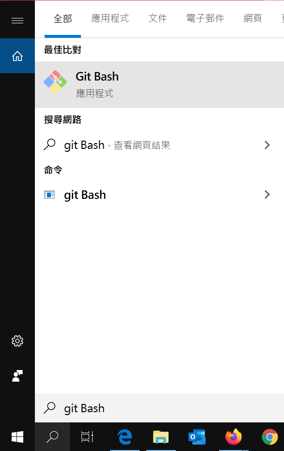
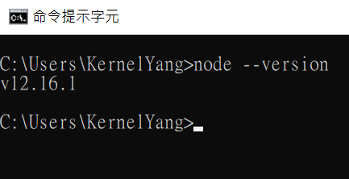

# 事前準備：環境建置與工具安裝

本次 LAB 會需要使用到下述工具，請依序安裝

工具包含：
* Git
* Visual Studio Code
* Node.JS
* Express 產生器
* MySQL Workbench

# 安裝 Git
1. [下載檔案](https://git-scm.com/)

   [安裝教學](https://git-scm.com/book/zh-tw/v2/%E9%96%8B%E5%A7%8B-Git-%E5%AE%89%E8%A3%9D%E6%95%99%E5%AD%B8)
   
2. 開啟 Git Bash 進行初次設定

   

3. 在 Git Bash 設定你的使用者名稱及電子郵件
   
         git config --global user.name "<your username>"
         git config --global user.email <your email>

# 安裝 Visual Studio Code
   [下載檔案並安裝](https://code.visualstudio.com/)

# 安裝 Node.JS
1. [下載並安裝 Node.JS 12.16.1LTS版本](https://nodejs.org/en/)
2. 開啟 CMD 鍵入以下指令顯示版本號，確認安裝成功

         node --version

   

# 安裝 Express 產生器
   開啟 CMD 鍵入以下指令以安裝 Express 產生器

      npm install express-generator -g

# 安裝 MySQL Workbench
   [下載並安裝 MySQL Workbench 8.0.19](https://dev.mysql.com/downloads/workbench/)

