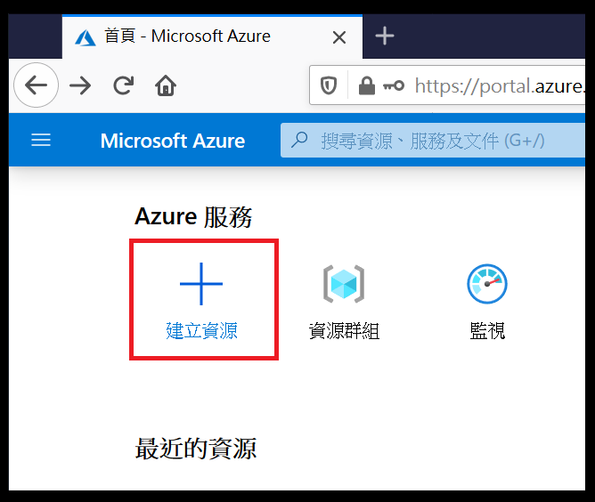
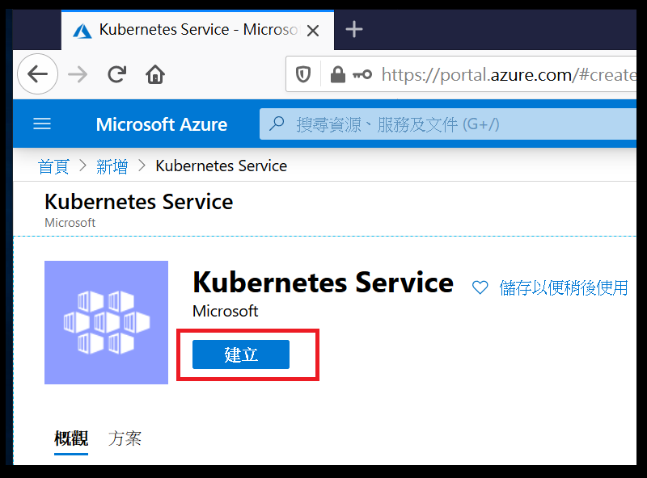

# 步驟一：建立 Azure Kubernetes Service (AKS)
## 1. 登入 Azure Portal

至 [Microsoft Azure 入口網站](https://azure.microsoft.com/zh-tw/features/azure-portal/) 登入你的帳戶

## 2. 點選建立資源

## 3. 搜尋 Kubernetes Service

## 4. 點選建立
   
   

## 5. 新建資源群組

資源群組是 Azure 平台的基礎元素，資源群組是為了協助管理及組織您的 Azure 資源而存在。 透過將具有類似使用方式、類型或位置的資源放置在一起，您可以針對您在 Azure 中所建立的資源提供一些秩序及組織。本次練習所使用的資源都將置於此資源群組。[more.](https://docs.microsoft.com/zh-tw/learn/modules/control-and-organize-with-azure-resource-manager/2-principles-of-resource-groups)

## 6. 輸入叢集詳細資料
   
滾動捲軸繼續輸入 Kubernetes 叢集名稱、區域、Kubernetes版本、DNS 名稱首碼

*區域請選擇東南亞*

*DNS 名稱首碼使用自動帶入的名稱首碼即可*

## 7. 設定節點大小

於 *主要節點集區* 設定節點大小，本次練習使用的節點大小為 *標準 B2s*

## 8. 設定節點計數

於 *主要節點集區* 設定節點計數，本次練習使用的節點計數為 *1*
調整方式可以透過拉動捲軸或是直接輸入

## 9. 檢閱 + 建立

## 10. 完成建立

---
* [事前準備](./0_Prework.md)：環境建置與工具安裝
* now→[步驟一](./1_AKS.md)：建立 Azure Kubernetes Service (AKS)
* [步驟二](./2_ACR.md)：建立 Azure Container Registry (ACR)
* [步驟三](./3_MySQL.md)：建立 Azure Database for MySQL
* [步驟四](./4_CreateProject.md)：建立 Azure DevOps Repository 與 Node.js Express 專案
* [步驟五](./5_Coding.md)：撰寫程式碼
* [步驟六](./6_PipelineDeploy.md)：建立Azure DevOps Pipeline 部署至Azure Kubernetes Service (AKS)
* [步驟七](./7_CICD.md)：修改 source code 觸發 CI/CD