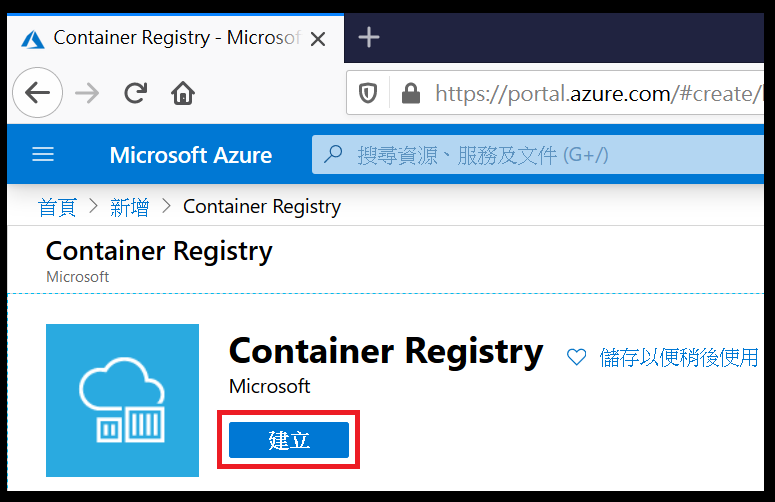

# 步驟二：建立 Azure Container Registry (ACR)
## 1. 點擊 Microsoft Azuer 回到首頁並點選建立資源

## 2. 搜尋 Container Registry

## 3. 點選建立

## 4. 選擇資源群組

選擇在步驟一所建立的資源群組

*注意，MC_開頭的資源群組為 Azure 建立的資源群組，專為Kubernetes使用*

*小心不要選錯了*

## 5. 輸入執行個體詳細資料

滾動捲軸繼續輸入登錄名稱、選擇位置、管理使用者、選擇SKU

*位置請選擇東南亞*

*停用管理使用者*

*SKU選擇基本*

## 6. 檢閱 + 建立

## 7. 完成建立

---
* [事前準備](./0_Prework.md)：環境建置與工具安裝
* [步驟一](./1_AKS.md)：建立 Azure Kubernetes Service (AKS)
* now→[步驟二](./2_ACR.md)：建立 Azure Container Registry (ACR)
* [步驟三](./3_MySQL.md)：建立 Azure Database for MySQL
* [步驟四](./4_CreateProject.md)：建立 Azure DevOps Repository 與 Node.js Express 專案
* [步驟五](./5_Coding.md)：撰寫程式碼
* [步驟六](./6_PipelineDeploy.md)：建立Azure DevOps Pipeline 部署至Azure Kubernetes Service (AKS)
* [步驟七](./7_CICD.md)：修改 source code 觸發 CI/CD