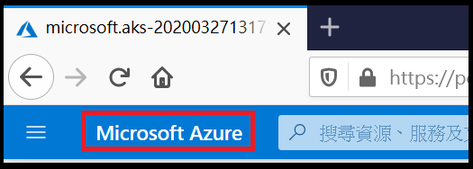
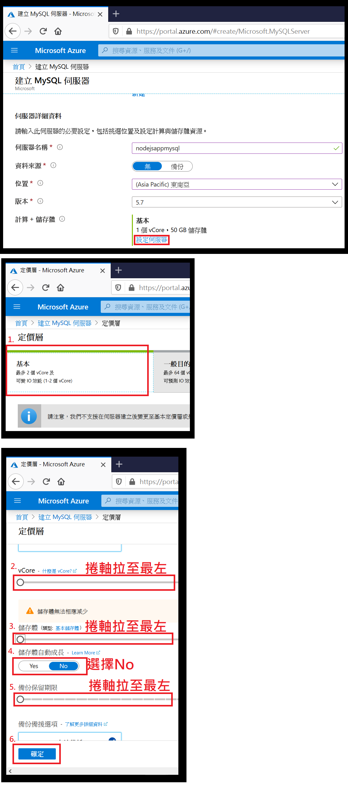

# 步驟三：建立 Azure Database for MySQL
## 1. 點擊 Microsoft Azuer 回到首頁並點選建立資源

## 2. 搜尋 Azure Database for MySQL

## 3. 點選建立

## 4. 選擇資源群組

選擇在步驟一所建立的資源群組

*注意，MC_開頭的資源群組為 Azure 建立的資源群組，專為Kubernetes使用*

*小心不要選錯了*

## 5. 輸入伺服器詳細資料

滾動卷軸繼續伺服器名稱、資料來源、位置、版本

*資料來源請選擇 無*

*位置請選擇東南亞*

*版本請選擇 5.7*

## 6. 設定計算+儲存體

於 *伺服器詳細資料* 設定 計算+儲存體

## 7. 輸入 Administrator 帳戶

於 *Administrator 帳戶* 輸入管理使用者名稱、密碼、確認密碼

## 8. 檢閱 + 建立

## 9. 完成建立

## 10. 檢視 MySQL Dabase 資訊

Host name 與 Username 會在後續練習中用到

## 11. 設定連線安全性

將目前IP加入Azure Database for MySQL白名單以確保在你的電腦可以連至此 Database，並且，因為部署到Azure Kubernetes Service的網頁應用程式將存取此 Database 所以設定允許存取 Azure 服務。

## 12. 建立本機與 Azure Database for MySQL 的連線 

開啟本機安裝的 Workbench 並建立連線

## 13. 新增 Database Schema

使用 Workbench 新增一個 Database Schema

## 14. 新增 Table

執行以下語法新增 Table
    
    CREATE TABLE Result(
        id INT NOT NULL AUTO_INCREMENT,
        `datetime` datetime NOT NULL,
        username nvarchar(50) NOT NULL,
        score int NOT NULL,
        PRIMARY KEY (id)
    );

---
* [事前準備](./0_Prework.md)：環境建置與工具安裝
* [步驟一](./1_AKS.md)：建立 Azure Kubernetes Service (AKS)
* [步驟二](./2_ACR.md)：建立 Azure Container Registry (ACR)
* now→[步驟三](./3_MySQL.md)：建立 Azure Database for MySQL
* [步驟四](./4_CreateProject.md)：建立 Azure DevOps Repository 與 Node.js Express 專案
* [步驟五](./5_Coding.md)：撰寫程式碼
* [步驟六](./6_PipelineDeploy.md)：建立Azure DevOps Pipeline 部署至Azure Kubernetes Service (AKS)
* [步驟七](./7_CICD.md)：修改 source code 觸發 CI/CD