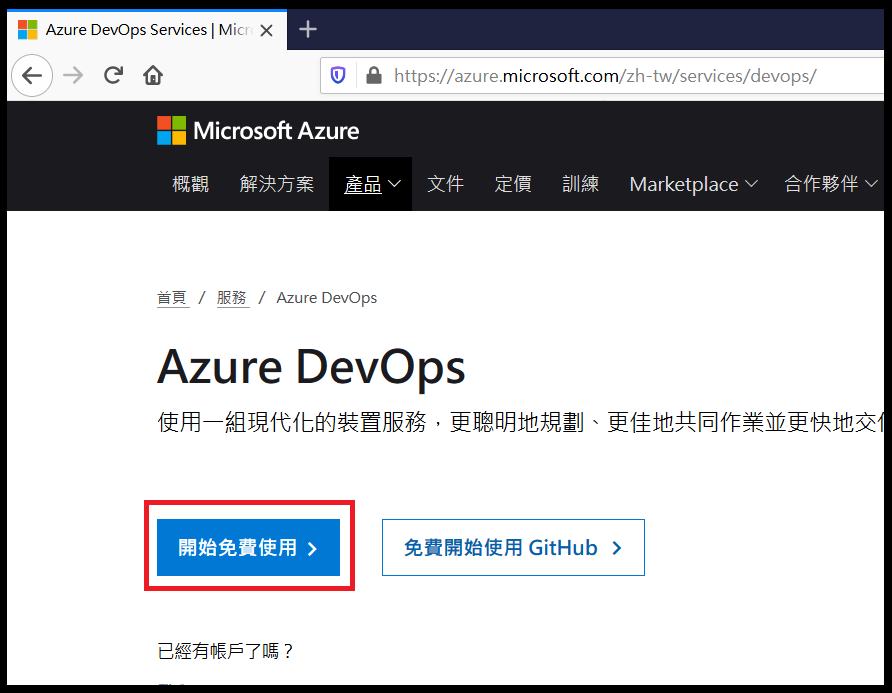
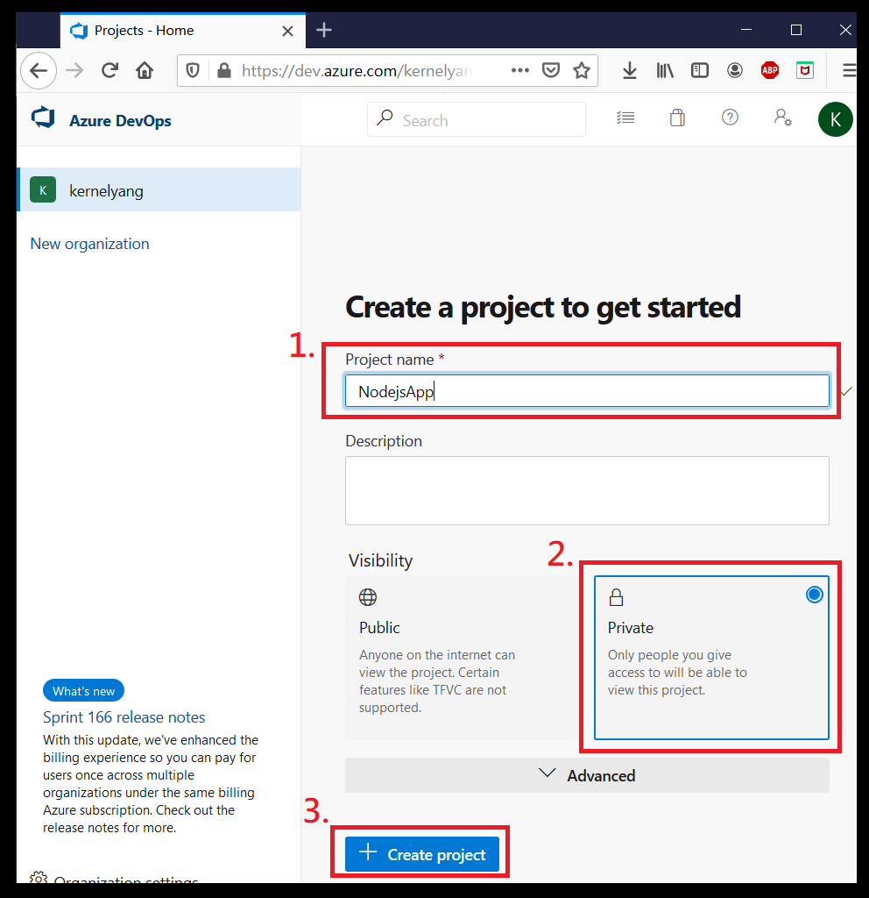
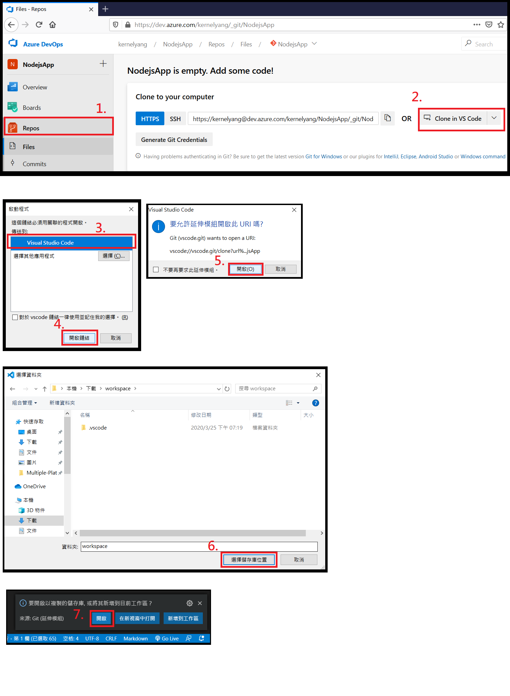
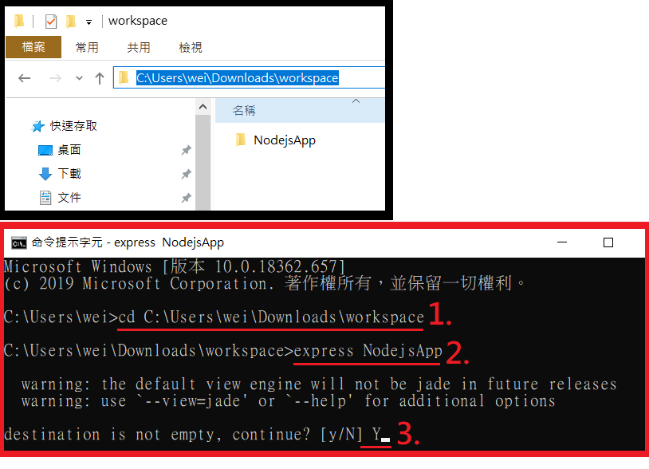
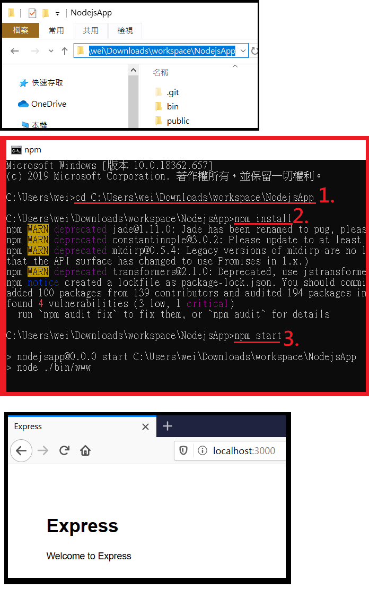
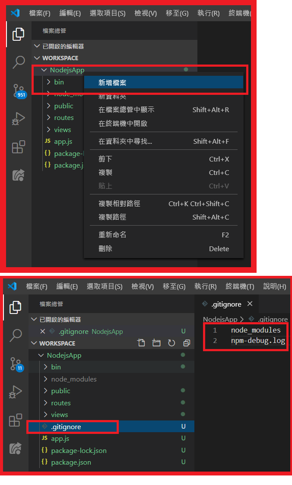
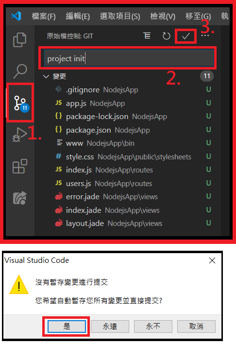
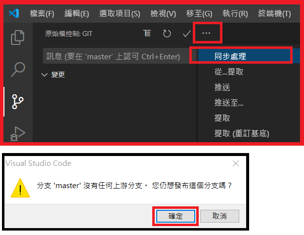

# 步驟四：建立 Azure DevOps Repository 與 Node.js Express 專案
## 1. 登入 Azure DevOps

至 [Azure DevOps](https://azure.microsoft.com/zh-tw/services/devops/) 登入你的帳戶

## 2. 建立新的 Project

在 Azure DevOps 中為你的 Node.js 網頁應用程式新增專案

*選擇 Private*

## 3. 將 Repository Clone 至本機

請選擇一個目錄作為專案的存放路徑

## 4. 建立 Node.js Express 專案

在 CMD 中切換至選擇的目錄，切換指令如下
    
    cd 目錄路徑

並鍵入以下指令以建立 Express 專案，過程中會再詢問你是否再已存在的資料夾建立專案，此時請再輸入 Y 繼續建立

    express 專案目錄名稱

## 5. 安裝相依組件並啟動網頁應用程式

在 CMD 中切換至專案的目錄，切換指令如下
    
    cd 專案目錄路徑

並鍵入以下指令以安裝相依組件

    npm install

鍵入以下指令以啟動網頁應用程式，此後即可在瀏覽器輸入 localhost:3000 看見執行畫面

    npm start

## 6. 加入 .gitignore

在專案根目錄下新增 .gitignore 檔案，並輸入以下內容並存檔

*此舉為將相依模組從版控排除，存檔後可以看到版控的數字變化*

    node_modules
    npm-debug.log

## 7. 完成第一次 commit

切換版控頁面後輸入訊息並完成 commit

## 8. 同步至 Azure DevOps

---
* [事前準備](./0_Prework.md)：環境建置與工具安裝
* [步驟一](./1_AKS.md)：建立 Azure Kubernetes Service (AKS)
* [步驟二](./2_ACR.md)：建立 Azure Container Registry (ACR)
* [步驟三](./3_MySQL.md)：建立 Azure Database for MySQL
* now→[步驟四](./4_CreateProject.md)：建立 Azure DevOps Repository 與 Node.js Express 專案
* [步驟五](./5_Coding.md)：撰寫程式碼
* [步驟六](./6_PipelineDeploy.md)：建立Azure DevOps Pipeline 部署至Azure Kubernetes Service (AKS)
* [步驟七](./7_CICD.md)：修改 source code 觸發 CI/CD