# 步驟五：撰寫程式碼
## 1. 安裝 mysql 模組

本次練習將透過 mysql 模組操作 Azure Database for MySQL

在 CMD 中切換至專案的目錄，切換指令如下

    cd 專案目錄路徑

並鍵入以下指令以安裝 mysql 模組

    npm install mysql

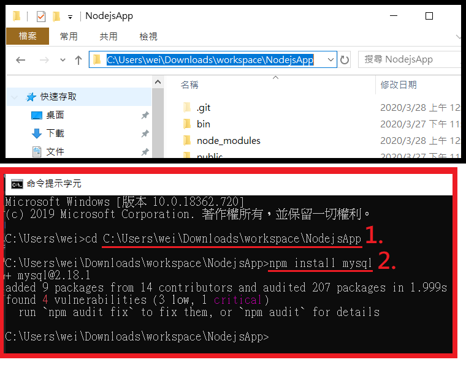

從 Visual studio code 可看見此次變更，輸入訊息並完成 commit

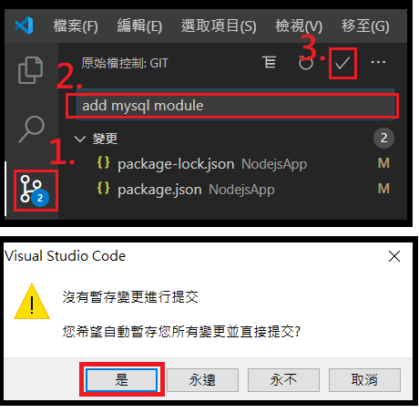

## 2. 建立控制器

在專案的 routes 目錄中，建立名為 game.js 的新檔案。
並在 game.js 檔案加入以下程式碼並儲存。此程式碼將依據所傳入的要求使用 mysql 模組操作 Azure Database for MySQL。

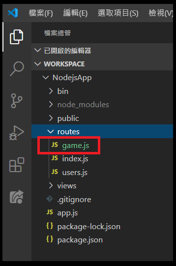

    const mysql = require('mysql');
    const config = require('../config');

    class Game {

        async Index(req, res) {
            // res.render('index', { title: 'Express' });
            res.render('index');
        }

        async WriteResult(req, res) {
            var conn = new mysql.createConnection(config);
            var item = req.body;
            conn.connect(
                function (err) {
                    if (err) {
                        console.log("!!! Cannot connect !!! Error:");
                        throw err;
                    }
                    else {
                        console.log("Connection established.");
                        addData();
                    }
                });
            function addData() {
                conn.query('INSERT INTO Result (`datetime`, username, score) VALUES (?, ?, ?);', [new Date(), item.username, item.score],
                    function (err, results, fields) {
                        if (err) throw err;
                        console.log('Inserted ' + results.affectedRows + ' row(s).');
                        res.send(true);
                    })

                conn.end(function (err) {
                    if (err) throw err;
                    else console.log('Done.')
                });
            }
        }

        async ReadResult(req, res) {
            var item = req.body;

            var conn = new mysql.createConnection(config);
            conn.connect(
                function (err) {
                    if (err) {
                        console.log("!!! Cannot connect !!! Error:");
                        throw err;
                    }
                    else {
                        console.log("Connection established.");
                        getData();
                    }
                });
            function getData() {
                conn.query('SELECT * FROM Result WHERE username = ? ORDER BY `datetime` DESC', [item.username],
                    function (err, results, fields) {
                        if (err) throw err;
                        else {
                            res.json(results);
                        }
                    })

                conn.end(function (err) {
                    if (err) throw err;
                    else console.log('Done.')
                });

            }
        }

        async DeleteResult(req, res) {
            var conn = new mysql.createConnection(config);
            var item = req.body;
            conn.connect(
                function (err) {
                    if (err) {
                        console.log("!!! Cannot connect !!! Error:");
                        throw err;
                    }
                    else {
                        console.log("Connection established.");
                        addData();
                    }
                });
            function addData() {
                conn.query('DELETE FROM Result WHERE username = ?', [item.username],
                    function (err, results, fields) {
                        if (err) throw err;
                        console.log('Delete ' + results.affectedRows + ' row(s).');
                        res.send(true);
                    })

                conn.end(function (err) {
                    if (err) throw err;
                    else console.log('Done.')
                });
            }
        }
    }

    module.exports = Game;

從 Visual studio code 可看見此次變更，輸入訊息並完成 commit

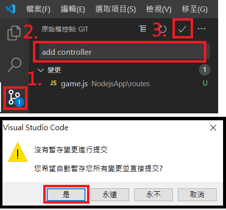

## 3. 新增 config.js

在專案目錄的根目錄中，建立名為 config.js 的新檔案。並在 config.js 檔案加入以下程式碼並將 host、user、password、database 的值變更為符合 Azrue Database for MySQL 的值 ([忘記 host、user 可參考步驟三](./3_MySQL.md))，然後儲存。 此程式碼會定義組態設定和應用程式所需的值。

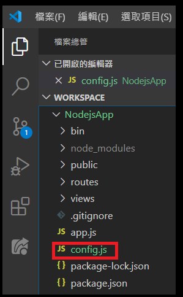

    const config =
    {
        // the information of your Azure Database for MySQL account
        host: '[the host of your Azure Database for MySQL account]',
        user: '[the user of your Azure Database for MySQL account]',
        password: '[the password of your Azure Database for MySQL account]',
        database: '[the database of your Azure Database for MySQL account]',
        port: 3306,
        ssl: true,
    };
    module.exports = config;

從 Visual studio code 可看見此次變更，輸入訊息並完成 commit

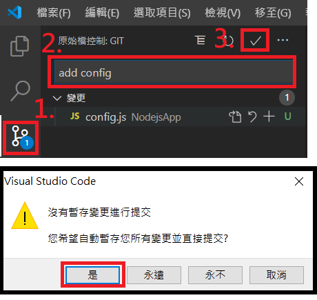

## 4. 修改 app.js

在專案目錄中，開啟 app.js 檔案。 這是稍早建立 Express 網頁應用程式時所建立的檔案。並在 app.js 檔案加入以下程式碼並儲存。

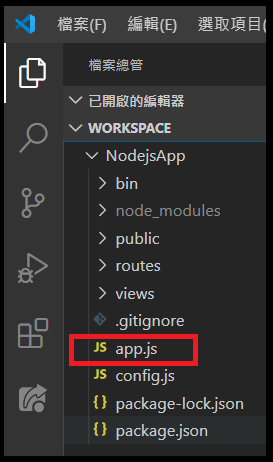

    var createError = require('http-errors');
    var express = require('express');
    var path = require('path');
    var cookieParser = require('cookie-parser');
    var logger = require('morgan');

    // var indexRouter = require('./routes/index');
    // var usersRouter = require('./routes/users');
    var Game = require('./routes/game');

    var app = express();

    // view engine setup
    app.set('views', path.join(__dirname, 'views'));
    app.set('view engine', 'jade');

    app.use(logger('dev'));
    app.use(express.json());
    app.use(express.urlencoded({ extended: false }));
    app.use(cookieParser());
    app.use(express.static(path.join(__dirname, 'public')));

    // app.use('/', indexRouter);
    // app.use('/users', usersRouter);

    // Game App
    const game = new Game();
    app.get('/', (req, res, next) => game.Index(req, res).catch(next))
    app.post('/api/WriteResult', (req, res, next) => game.WriteResult(req, res).catch(next))
    app.post('/api/ReadResult', (req, res, next) => game.ReadResult(req, res).catch(next))
    app.post('/api/DeleteResult', (req, res, next) => game.DeleteResult(req, res).catch(next))
    app.use(express.static(__dirname + '/public'));

    // catch 404 and forward to error handler
    app.use(function (req, res, next) {
    next(createError(404));
    });

    // error handler
    app.use(function (err, req, res, next) {
    // set locals, only providing error in development
    res.locals.message = err.message;
    res.locals.error = req.app.get('env') === 'development' ? err : {};

    // render the error page
    res.status(err.status || 500);
    res.render('error');
    });

    module.exports = app;

從 Visual studio code 可看見此次變更，輸入訊息並完成 commit

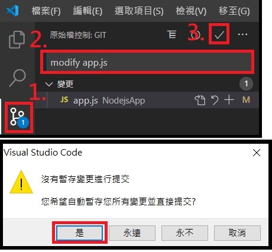

## 5. 修改 index.jade

在專案的 views 目錄中，開啟 index.jade 檔案。 這是稍早建立 Express 網頁應用程式時所建立的檔案。並在 index.jade 檔案加入以下程式碼並儲存。

*本次練習使用的 Express 框架以 Jade 作為檢視引擎。*

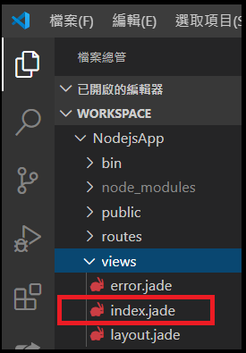

    doctype html
    html
    head
        title Whack-a-mole
        link(rel='stylesheet', href='https://maxcdn.bootstrapcdn.com/bootstrap/3.3.7/css/bootstrap.min.css')
        link(rel='stylesheet', href='/stylesheets/whack_a_mole.css')

    body
        div(id='game')
        div(id='playground')
        div(id='score')
            h2(class='text-danger') Scoreboard
            h3
            span(class='text-info') Username: 
                span
                input(type="text" id="username" value="Kernel" style="width:100px;")
            h3
            span(class='text-info') Your score: 
                span
                span(id='current-score' class='scores') 0
            h3
            span(class='text-info') Level: 
                span
                span(id='current-level' class='scores') 1
            h3
            span(class='text-info') Life: 
            div(class='progress')
            div(id='progress' class='progress-bar' role='progressbar' aria-valuenow='100' aria-valuemin='0' aria-valuemax='100' style='width: 100%;') 100
            hr
            p
            select(id='sizing' class='form-control')
                option 3
                option 4
                option 5
                option 6
                option 7
            p
            button(id='start' class='btn btn-default') Start
            button(id='stop' class='btn btn-default') Stop
            p
            button(id='history' class='btn btn-default') History
            button(id='clear' class='btn btn-default') Clear
        div(id='control')

        script(src='https://ajax.googleapis.com/ajax/libs/jquery/2.2.4/jquery.min.js')
        script(src='https://maxcdn.bootstrapcdn.com/bootstrap/3.3.7/js/bootstrap.min.js')
        script(src='https://cdnjs.cloudflare.com/ajax/libs/jquery-cookie/1.4.1/jquery.cookie.min.js')
        script(src='/javascripts/whack_a_mole.js')

從 Visual studio code 可看見此次變更，輸入訊息並完成 commit

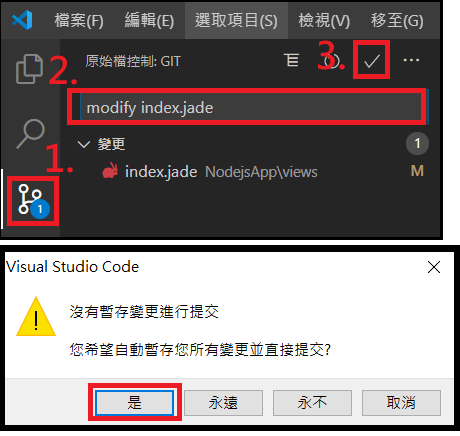

## 6. 加入 whack_a_mole.css

在專案的 public 目錄中找到 stylesheets 目錄，並在 stylesheets 目錄中建立名為 whack_a_mole.css 的新檔案。然後在 whack_a_mole.css 檔案加入以下程式碼並儲存。這段程式碼將定義樣式。

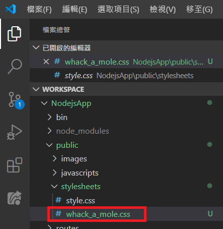

    .theline {
        height: 1px;
        width: 404px;
        background-color: black;
        margin-left: 62px;
    }

    #closeBtn {
        border-radius: 50%;
        position: absolute;
        right: 0;
        top: 0;
        font-weight: 900;
        background-color: red;
        color: white;
    }

    #thePanel {
        font-size: 20px;
        font-family: Microsoft JhengHei;
        overflow-y: auto;
        padding-top: 23px;
        text-align: center;
        height: 589px;
        width: 534px;
        background-image: url(/images/panel.png);
        background-repeat: no-repeat;
        position: fixed;
        top: 10%;
        left: 30%;
        animation: tra 1s;
    }

    @keyframes tra {
        from {
            top:0;
        }
        to {
            top: 10%;
        }
    }

    body {
        background: url(/images/bg-dirt.png);
    }

    #game {
        position: absolute;
        width: 100%;
        height: 100%;
    }

    #playground {
        /*cursor:url(/images/hummer.png), auto;/*url(/images/hummer.cur) , default;*/
        position: absolute;
        top: 0;
        left: 0;
        right: 0;
        bottom: 0;
        width: 1px;
        height: 1px;
        margin: auto;
    }

    #playground .mole {
        width: 120px;
        height: 120px;
        line-height: 120px;
        text-align: center;
        background-image: url(/images/grass-upper.png);
        background-repeat: no-repeat;
        background-size: 120px 60px;
        background-position: top 0;
        position: relative;
    }

    #playground .mole::before {
        content: "";
        width: 80px;
        height: 80px;
        background-image: url(/images/mole-laugh1.png);
        background-repeat: no-repeat;
        background-size: 80px 80px;
        background-position: top 0;
        position: absolute;
        top: 40px;
        left: 20px;
        opacity: .5;
        transition: all 1s;
    }

    #playground .mole.active::before {
        background-image: url(/images/mole.png);
        top: 0;
        opacity: 1;
        transition: all .3s;
    }

    #playground .mole.hit::before {
        background-image: url(/images/mole-thump4.png);
        top: 40px;
        opacity: 1;
        transition: all .2s;
    }

    #playground .mole::after {
        content: "";
        width: 120px;
        height: 60px;
        background-image: url(/images/grass-lower.png);
        background-repeat: no-repeat;
        background-size: 120px 60px;
        background-position: top 0;
        position: absolute;
        bottom: 0;
        left: 0;
    }

    #score {
        position: fixed;
        min-width: 250px;
        right: 0;
        top: 20px;
        background: rgba(50, 50, 50, .5);
        padding: 20px;
    }

從 Visual studio code 可看見此次變更，輸入訊息並完成 commit

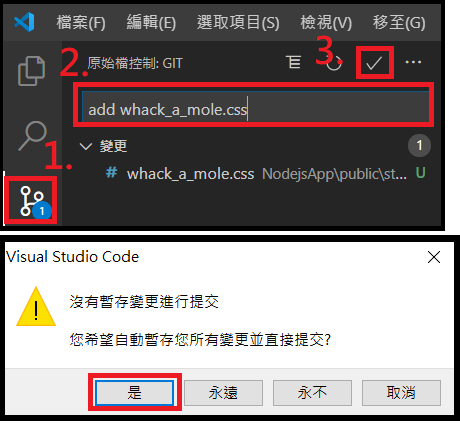

## 7. 加入 whack_a_mole.js

在專案的 public 目錄中找到 javascripts 目錄，並在 javascripts 目錄中建立名為 whack_a_mole.js 的新檔案。然後在 whack_a_mole.js 檔案加入以下程式碼並儲存。

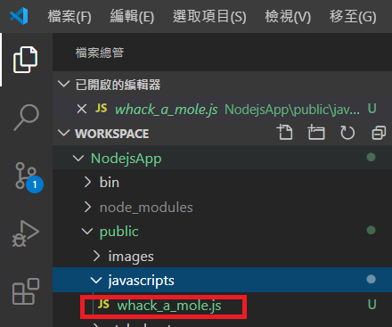

    $(function () {
        var score = 0,
            life = 100,
            timer = null,
            levelProfiles = [
                { level: 1, score: 0, moles: 1, interval: 1500 },
                { level: 2, score: 100, moles: 2, interval: 1500 },
                { level: 3, score: 200, moles: 2, interval: 1250 },
                { level: 4, score: 300, moles: 2, interval: 1000 },
                { level: 5, score: 500, moles: 3, interval: 1000 },
                { level: 6, score: 1000, moles: 3, interval: 750 },
            ];

        var $playground = $("#playground");

        $("#sizing").change(function () {
            var $this = $(this);
            createPlayground($this.val());
        });

        $("#start").click(function () {
            startGame();
        });

        $("#stop").click(function () {
            stopGame();
        });
        $('#history').click(function () {
            readData();
        });
        $('#clear').click(function () {
            clearData();
        });

        function createPlayground(edge) {
            $playground.empty();

            var $table = $("<table></table>"),
                counter = 0;

            for (var i = 0; i < edge; i++) {
                var $tr = $("<tr></<tr>");
                for (var j = 0; j < edge; j++) {
                    var $td = $("<td></<td>")
                        .appendTo($tr);

                    var $div = $("

")
                        .addClass("mole")
                        .appendTo($td);
                }
                $tr.appendTo($table);
            }
            $table
                .appendTo($playground)
                .css({
                    marginTop: -1 * ($table.outerHeight() / 2),
                    marginLeft: -1 * ($table.outerWidth() / 2)
                });
        }

        function startGame() {
            score = 0;
            life = 100;
            updateLife();
            clearTimeout(timer);
            nextMole();
        }

        function stopGame() {
            clearTimeout(timer);
            $(".mole.active").removeClass("active")
            $(".mole.hit").removeClass("hit")
            writeData();
            score = 0;
            life = 100;
            updateLife();
            updateScore();
        }

        function getLevelProfile() {
            var levelProfile = levelProfiles[0];

            for (var i = 0; i < levelProfiles.length; i++) {
                if (score >= levelProfiles[i].score) {
                    levelProfile = levelProfiles[i];
                }
                else {
                    break;
                }
            }
            return levelProfile;
        }

        function updateScore() {
            $("#current-score").text(score);
        }

        function updateLife() {
            $("#progress")
                .attr("aria-valuenow", life)
                .css("width", life + "%")
                .text(life);
        }

        function nextMole() {
            var $moles = $playground.find(".mole"),
                levelProfile = getLevelProfile();

            var active = $moles.filter(".active").length;
            var hit = $moles.filter(".hit").length;
            life -= Math.max(0, active - hit);
            updateLife();

            if (life <= 0) {
                stopGame();
                alert("GAME OVER!");
                return;
            }

            $moles.removeClass("active").removeClass("hit");

            $("#current-level").text(levelProfile.level);

            for (var i = 0; i < levelProfile.moles; i++) {
                var next = Math.floor(Math.random() * $moles.length);
                $moles.eq(next).addClass("active");
            }

            timer = setTimeout(nextMole, levelProfile.interval);
        }

        createPlayground(3);
        $('#playground').on('mouseup', '.mole', function (event) {
            var $this = $(this);
            if ($this.attr('class').indexOf('active') > 0) {
                $('#thevoice').remove();
                $('<audio></audio>')
                    .attr('id', 'thevoice')
                    .attr('src', '/images/5558.wav')
                    .attr('autoplay', 'autoplay')
                    .appendTo($('body'));
                score += 10;
                updateScore();

                $this
                    .removeClass("active")
                    .addClass("hit");
            }
        });
        function writeData() {
            var username = $('#username').val();
            $.ajax({
                url: "/api/WriteResult",
                type: "post",
                data: { username: username, score: score },
                success: function (result, status, xhr) {
                    console.log(result);
                }
            });
        }
        function readData() {
            var username = $('#username').val();
            $.ajax({
                url: "/api/ReadResult",
                type: "post",
                data: { username: username },
                success: function (result, status, xhr) {
                    var str = "";
                    if (result.length != 0) {
                        $(result).each(function (i, item) {
                            str = str + item.score + "分" + "&nbsp&nbsp" + item.datetime + "

";
                        });
                    }
                    else {
                        str = '無資料';
                    }
                    $('#thePanel').remove();
                    var $body = $('body')
                    var box = $('

')
                        .html(str)
                        .attr('id', 'thePanel')
                        .appendTo($body);
                    $('<input>')
                        .attr('value', 'X')
                        .attr('type', 'button')
                        .attr('id', 'closeBtn')
                        .attr('onclick', "$('#thePanel').remove();")
                        .appendTo(box);
                }
            });
        }
        function clearData() {
            var username = $('#username').val();
            $.ajax({
                url: "/api/DeleteResult",
                type: "post",
                data: { username: username },
                success: function (result, status, xhr) {
                    console.log(result);
                }
            });
        }
    });

從 Visual studio code 可看見此次變更，輸入訊息並完成 commit

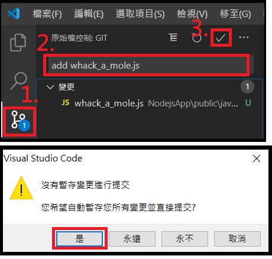

## 8. 加入 .dockerignore

在專案目錄的根目錄中，建立名為 .dockerignore 的新檔案。並在 .dockerignore 檔案中家入以下內容。以下內容將會使得在封裝成 image 時，排除以下檔案。

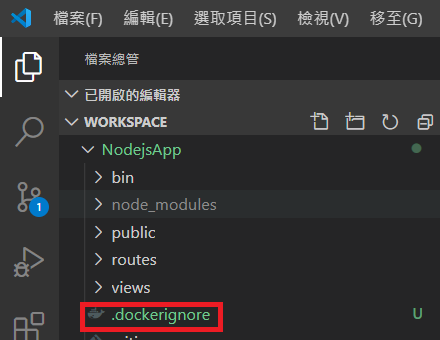

    node_modules
    npm-debug.log

從 Visual studio code 可看見此次變更，輸入訊息並完成 commit

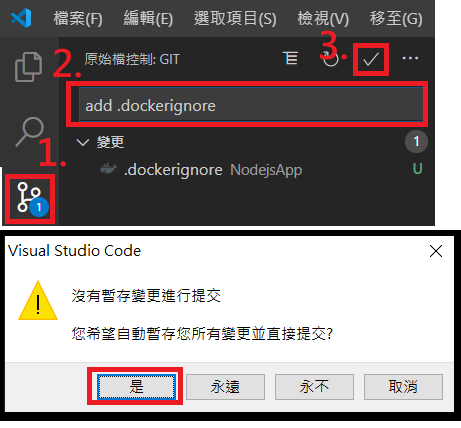

## 9. 加入 Dockerfile

在專案目錄的根目錄中，建立名為 Dockerfile 的新檔案。並在 Dockerfile 檔案中家入以下內容。此內容將定義封裝成 image 時的參數。

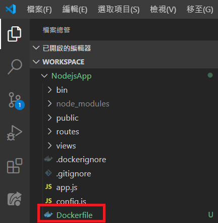

    FROM node:12

    WORKDIR /usr/src/app

    COPY package*.json ./
    RUN npm ci --only=production

    COPY . .

    EXPOSE 3000
    CMD [ "npm", "start" ]

從 Visual studio code 可看見此次變更，輸入訊息並完成 commit

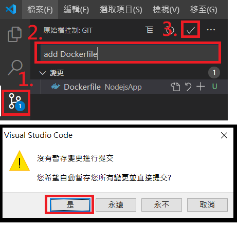

## 10. 加入網頁應用程式需要的音樂、圖片檔案

在專案的 public 目錄中找到 images 目錄，並在 images 目錄中加入網頁應用程式需要的音樂、圖片檔案。

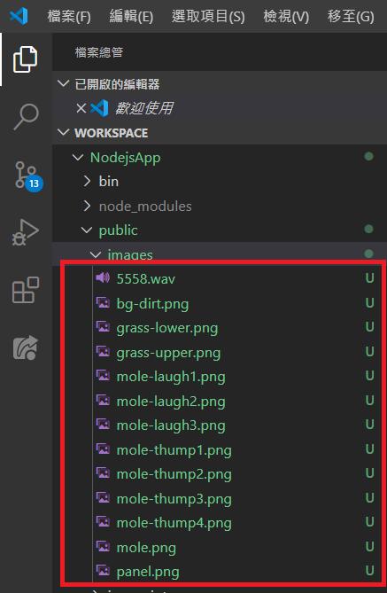

從 Visual studio code 可看見此次變更，輸入訊息並完成 commit

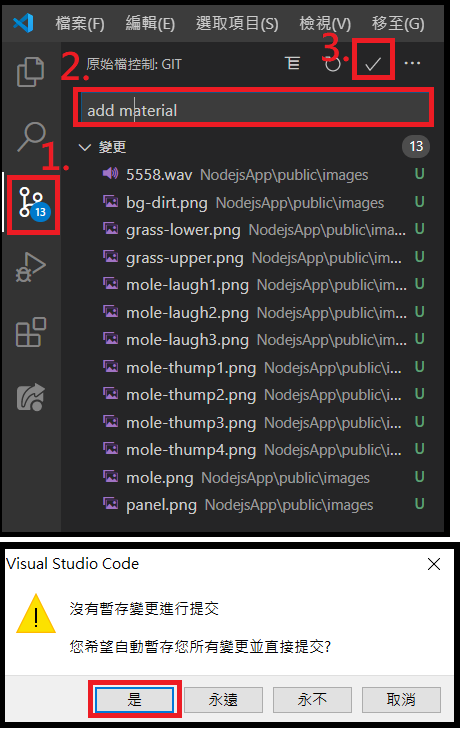

## 11. 在本機啟動網頁應用程式

在 CMD 中切換至專案的目錄，切換指令如下

    cd 專案目錄路徑

鍵入以下指令以啟動應用程式，並在瀏覽器輸入 localhost:3000 看見執行畫面

    npm start

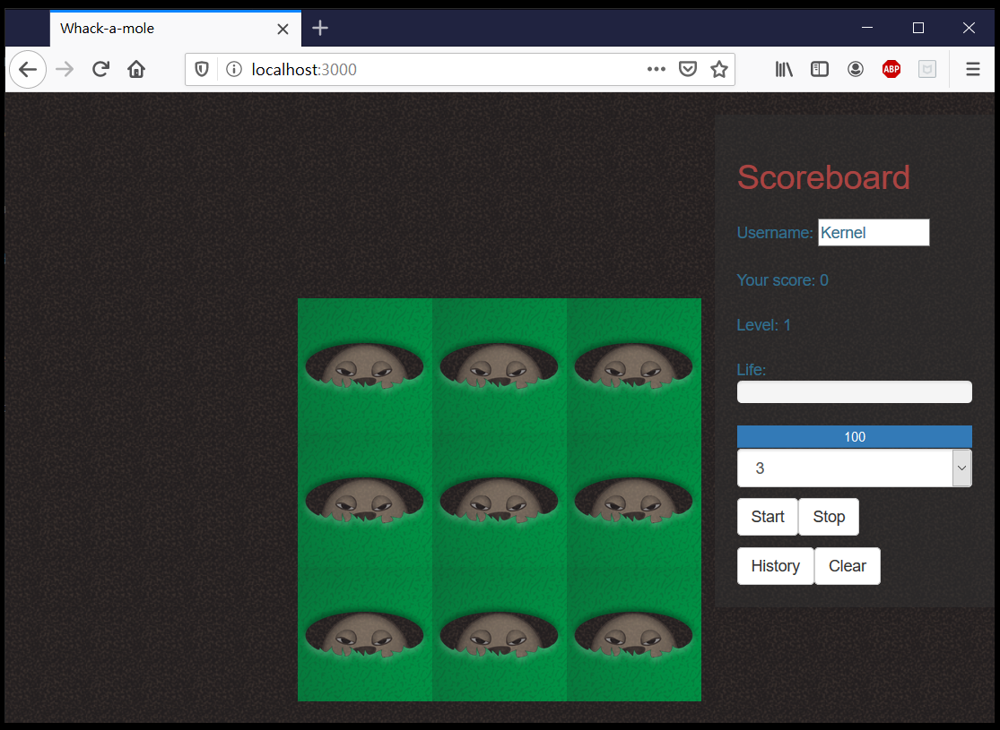

## 12. 同步至 Azure DevOps

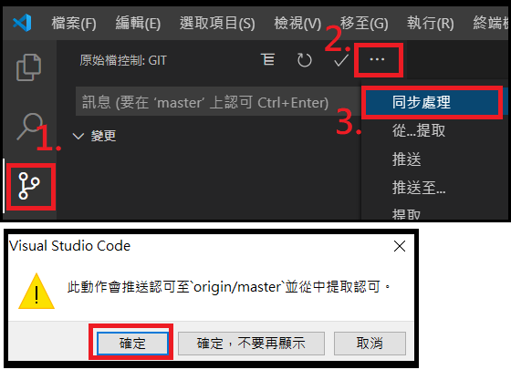

---
* [事前準備](./0_Prework.md)：環境建置與工具安裝
* [步驟一](./1_AKS.md)：建立 Azure Kubernetes Service (AKS)
* [步驟二](./2_ACR.md)：建立 Azure Container Registry (ACR)
* [步驟三](./3_MySQL.md)：建立 Azure Database for MySQL
* [步驟四](./4_CreateProject.md)：建立 Azure DevOps Repository 與 Node.js Express 專案
* now→[步驟五](./5_Coding.md)：撰寫程式碼
* [步驟六](./6_PipelineDeploy.md)：建立Azure DevOps Pipeline 部署至Azure Kubernetes Service (AKS)
* [步驟七](./7_CICD.md)：修改 source code 觸發 CI/CD