# 步驟六：建立Azure DevOps Pipeline 部署至Azure Kubernetes Service (AKS)

在本次練習中，我們將利用 Azure DevOps Pipeline 自動將 Azure DevOps Repository 中的網頁應用程式封裝成 image 並部署至 Azure Kubernetes Service (AKS) 中。

## 1. 登入 Azure DevOps

至 [Azure DevOps](https://azure.microsoft.com/zh-tw/services/devops/) 登入你的帳戶

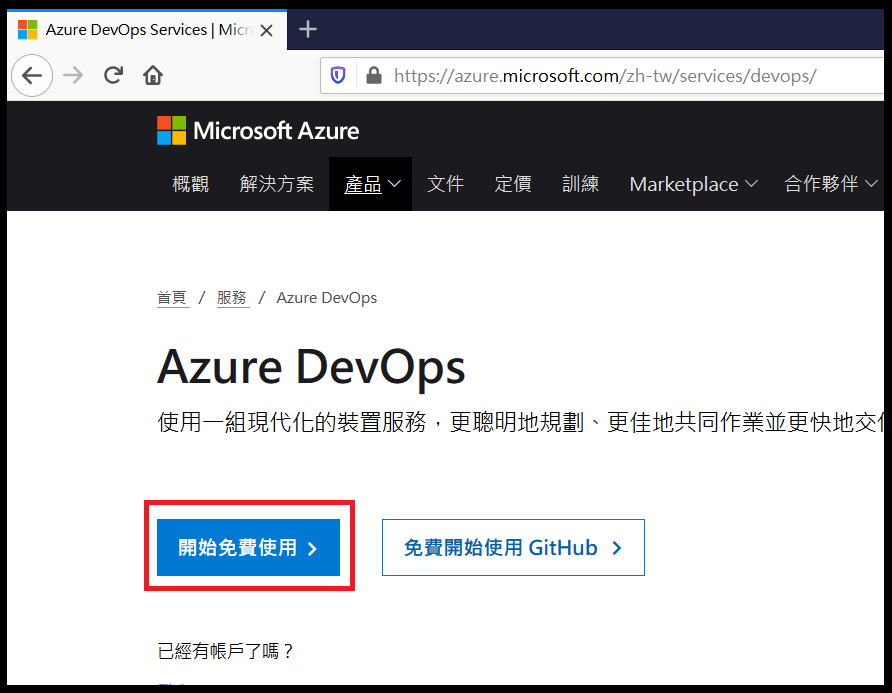

## 2. 進入你的專案

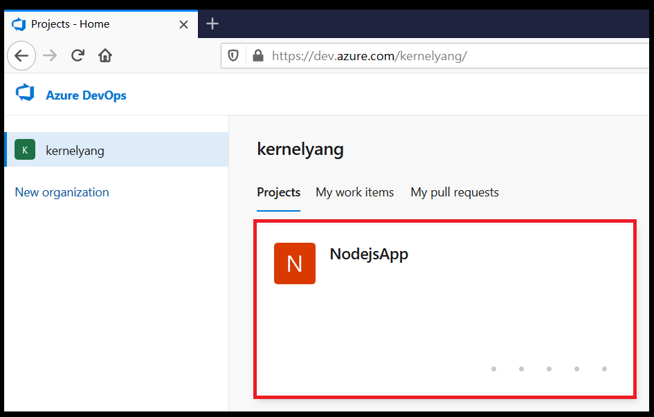

## 3. 建立 Azure DevOps Pipeline

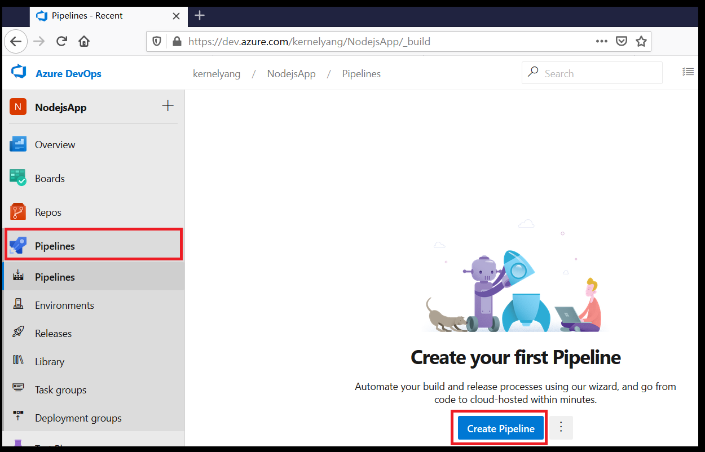

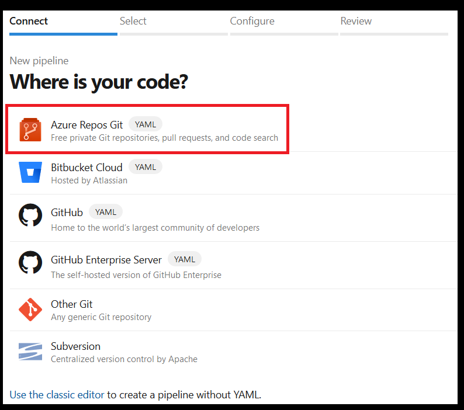

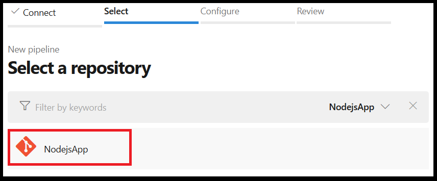

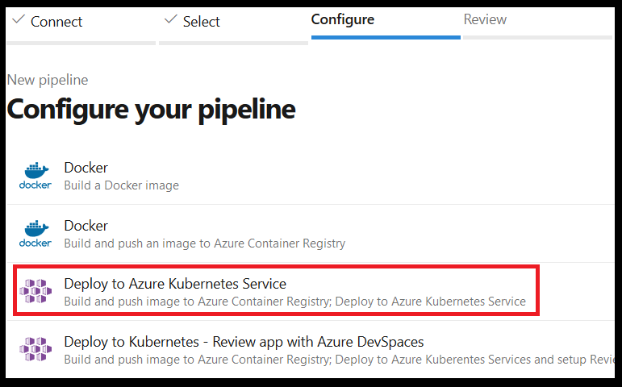

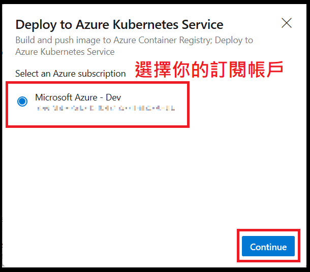

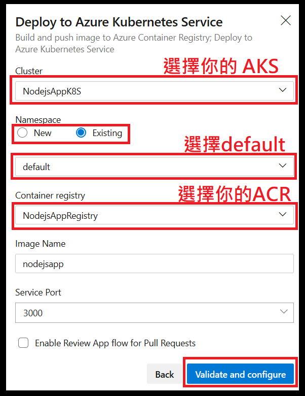

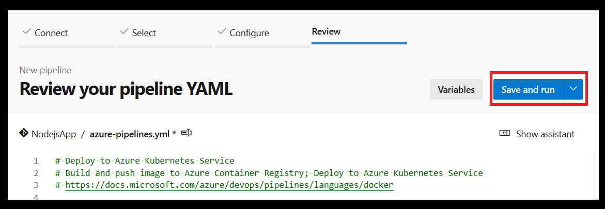

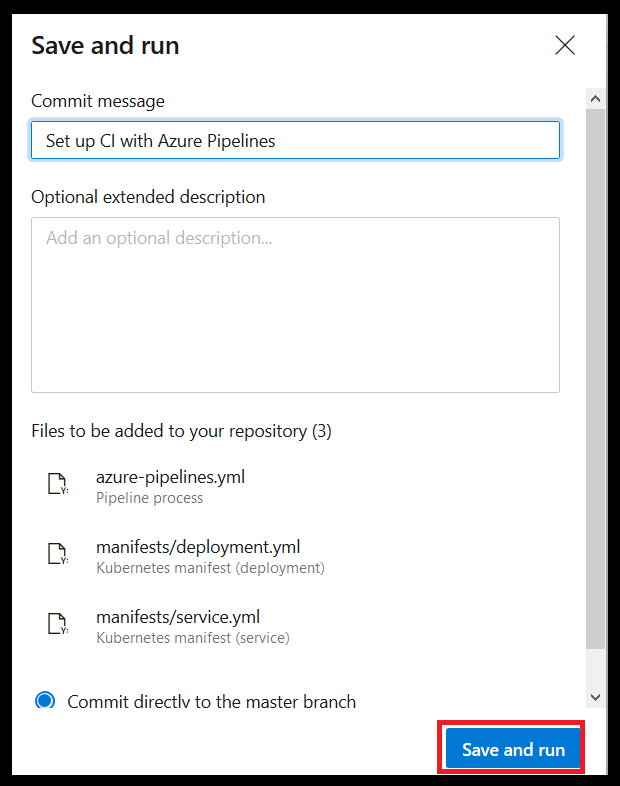

## 4. 等待 Azure DevOps Pipeline 完成建置與部署

建置與部署需要一些時間，點擊以下方塊可瀏覽建置與部署況

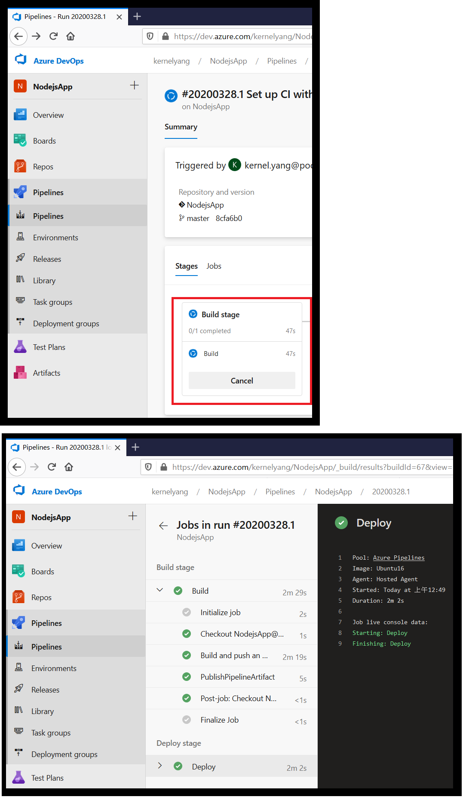

## 5. 瀏覽網頁應用程式

取得公用 IP 與輸出 Port

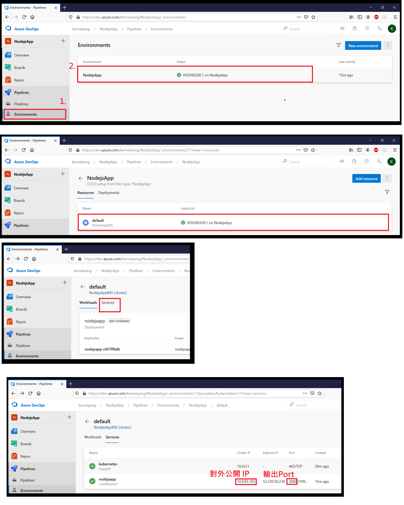

在瀏覽器輸入你的 IP 與 Port 即可瀏覽網頁應用程式
    
    http://你的IP:你的Port/

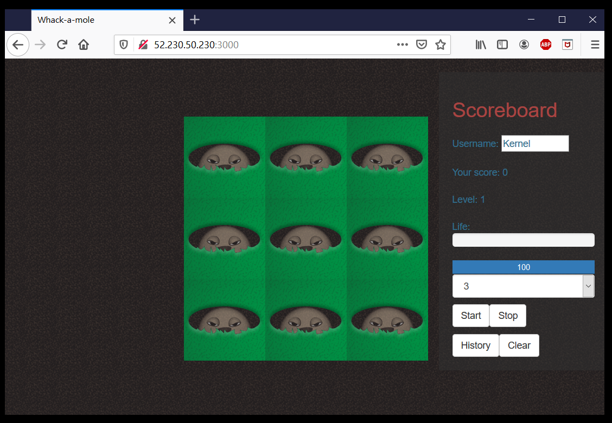

---
* [事前準備](./0_Prework.md)：環境建置與工具安裝
* [步驟一](./1_AKS.md)：建立 Azure Kubernetes Service (AKS)
* [步驟二](./2_ACR.md)：建立 Azure Container Registry (ACR)
* [步驟三](./3_MySQL.md)：建立 Azure Database for MySQL
* [步驟四](./4_CreateProject.md)：建立 Azure DevOps Repository 與 Node.js Express 專案
* [步驟五](./5_Coding.md)：撰寫程式碼
* now→[步驟六](./6_PipelineDeploy.md)：建立Azure DevOps Pipeline 部署至Azure Kubernetes Service (AKS)
* [步驟七](./7_CICD.md)：修改 source code 觸發 CI/CD