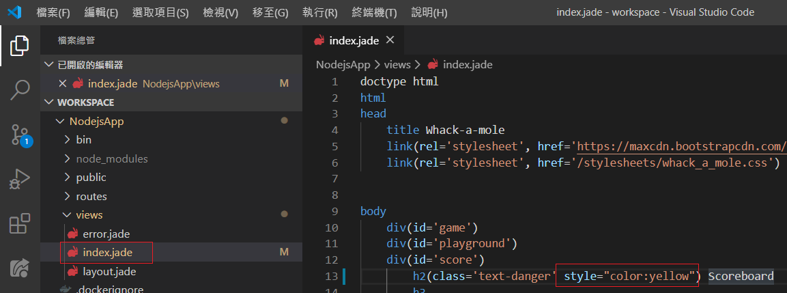
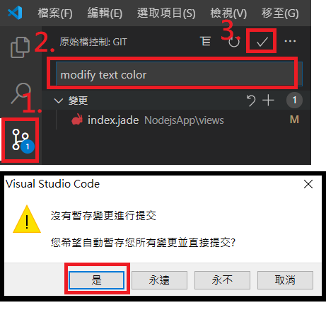
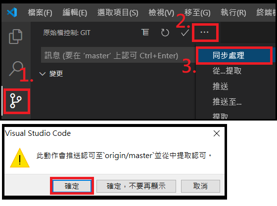
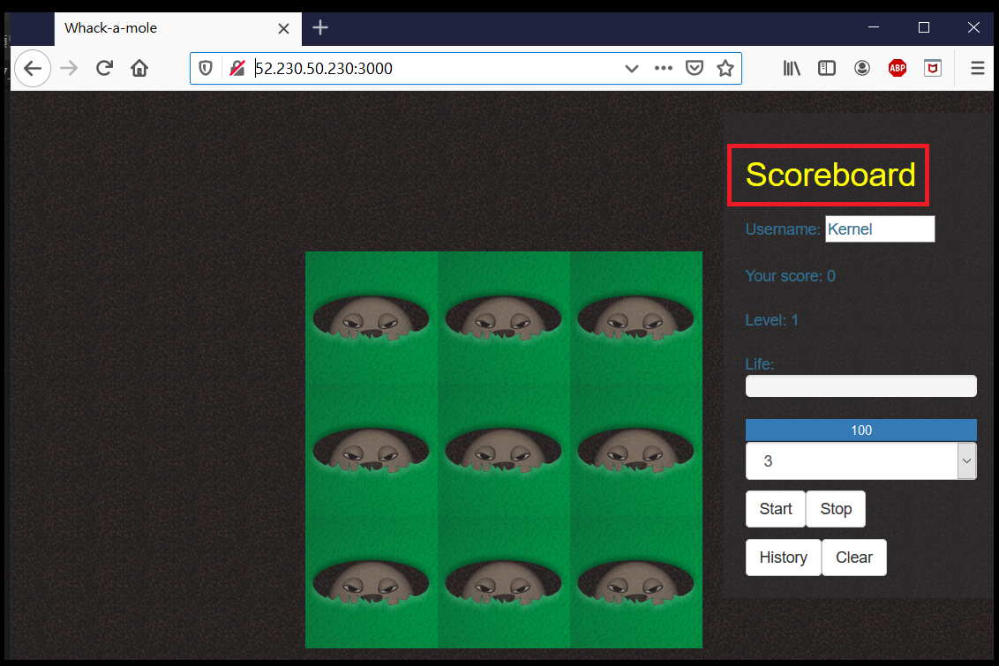
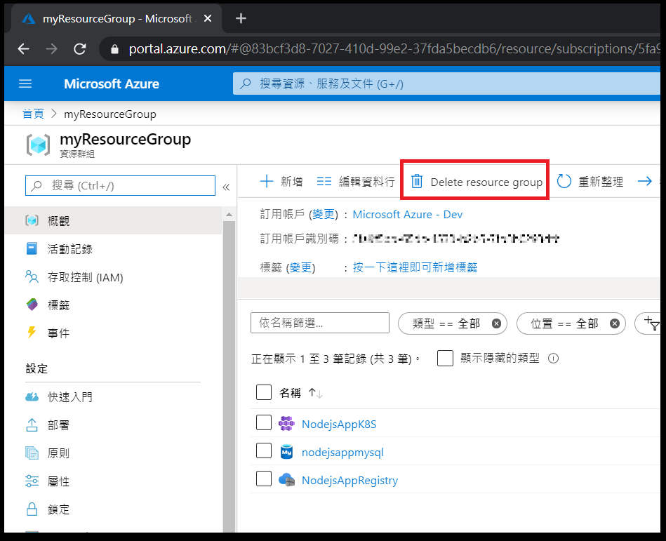

# 步驟七：修改 source code 觸發 CI/CD

在此步驟中，我們將稍微修改程式碼，並推送至 Azure DevOps Repository，Azure DevOps Pipeline 將自動建置並部署至 Azure Kuberneres Service。

## 1. 修改 index.jade

修改 index.jade 檔案中 h2 元素的屬性，其意義為將文字顏色改為黃色，修改完後存檔。

從 Visual studio code 可看見此次變更，輸入訊息並完成 commit

## 2. 同步至 Azure DevOps

## 3. 重新瀏覽應用程式

等待 Azure DevOps Pipeline 建置部署完成後，重新瀏覽應用程式。

## 4. 刪除資源與

練習完畢後將資源刪除以免產生費用，需要刪除的資源群組包含一開始由自己建立的，及建立 Azure Kubernetes Service 時一同建立的資源群組，為 MC_ 開頭。另外，於 Azure DevOps 所建立的專案並不會產生費用，可以自由決定是否保留。

---
* [事前準備](./0_Prework.md)：環境建置與工具安裝
* [步驟一](./1_AKS.md)：建立 Azure Kubernetes Service (AKS)
* [步驟二](./2_ACR.md)：建立 Azure Container Registry (ACR)
* [步驟三](./3_MySQL.md)：建立 Azure Database for MySQL
* [步驟四](./4_CreateProject.md)：建立 Azure DevOps Repository 與 Node.js Express 專案
* [步驟五](./5_Coding.md)：撰寫程式碼
* [步驟六](./6_PipelineDeploy.md)：建立Azure DevOps Pipeline 部署至Azure Kubernetes Service (AKS)
* now→[步驟七](./7_CICD.md)：修改 source code 觸發 CI/CD